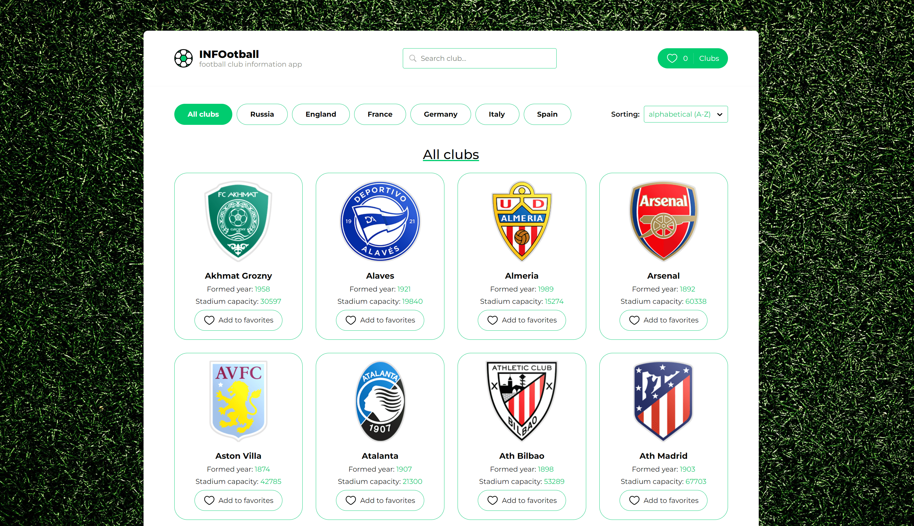

# INFOotball

"INFOotball" is an application for football enthusiasts who want to receive up-to-date information about their favorite football club. <br>
Add clubs to your favorites, view detailed information about them. <br>
And if you want to find a specific club, simply use the search bar or filtering.

<div>
    
</div>

### ⚽ [View published version]()

# Quick Start Guide
Before you begin, ensure that **Node.js** is installed on your system.

### Main Commands
- Installation - `npm install`
- Start Local Development Server - `npm run dev`
- Build Project - `npm run build`
- Lint Code - `npm run lint`
- Preview Production Build Locally - `npm run preview`

## React + TypeScript + Vite

This template provides a minimal setup to get React working in Vite with HMR and some ESLint rules.

Currently, two official plugins are available:

- [@vitejs/plugin-react](https://github.com/vitejs/vite-plugin-react/blob/main/packages/plugin-react/README.md) uses [Babel](https://babeljs.io/) for Fast Refresh
- [@vitejs/plugin-react-swc](https://github.com/vitejs/vite-plugin-react-swc) uses [SWC](https://swc.rs/) for Fast Refresh

## Expanding the ESLint configuration

If you are developing a production application, we recommend updating the configuration to enable type aware lint rules:

- Configure the top-level `parserOptions` property like this:

```js
export default {
  // other rules...
  parserOptions: {
    ecmaVersion: 'latest',
    sourceType: 'module',
    project: ['./tsconfig.json', './tsconfig.node.json'],
    tsconfigRootDir: __dirname,
  },
}
```

- Replace `plugin:@typescript-eslint/recommended` to `plugin:@typescript-eslint/recommended-type-checked` or `plugin:@typescript-eslint/strict-type-checked`
- Optionally add `plugin:@typescript-eslint/stylistic-type-checked`
- Install [eslint-plugin-react](https://github.com/jsx-eslint/eslint-plugin-react) and add `plugin:react/recommended` & `plugin:react/jsx-runtime` to the `extends` list
